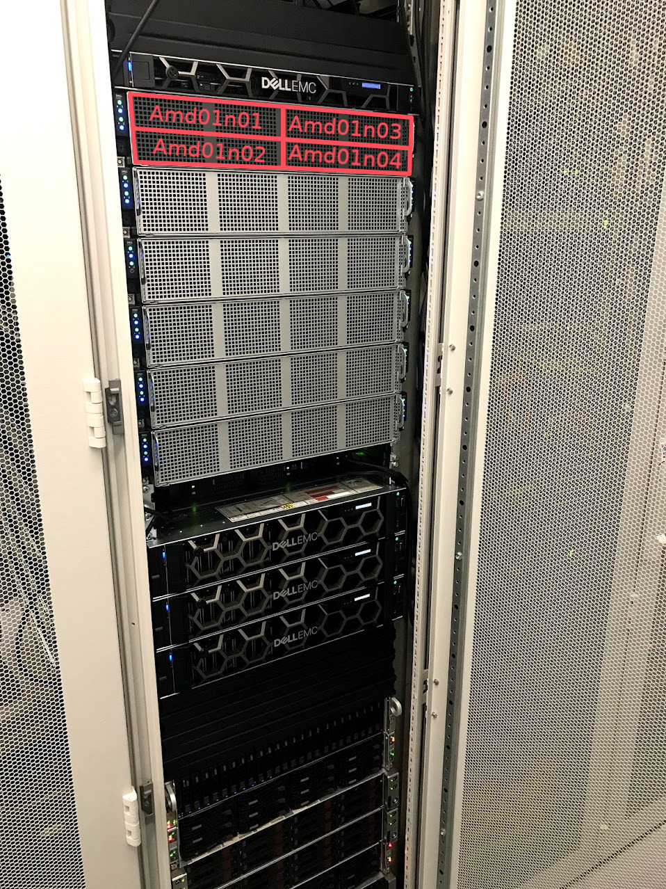
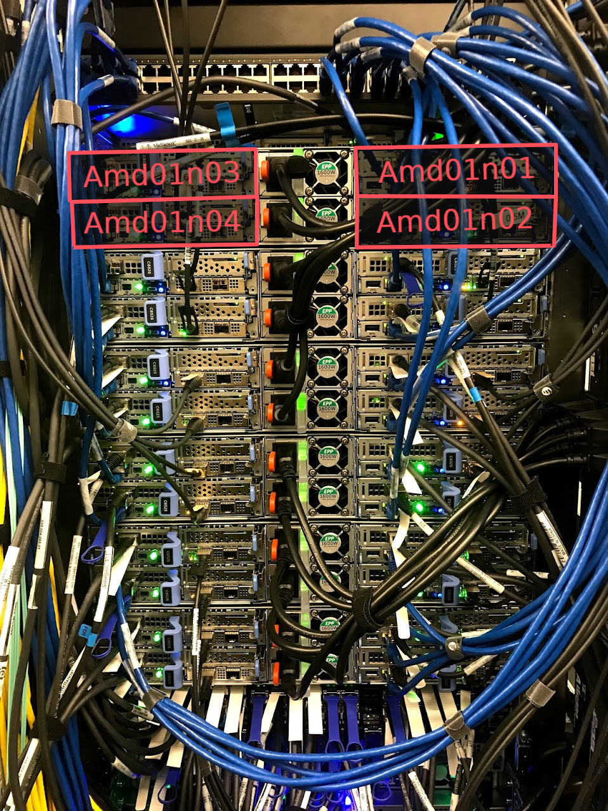

# HPC layout

To a first approximation a High Performance Computer (HPC) is a collection of large computers or servers (nodes) that are connected together.  There will also be some attached storage.

Rather than logging into the system and immediatly running your program or code, it is organsed into a job and submitted to a scheduler that takes your job and runs it on one of the nodes that has enough free resources (cpu and memory) to meet your job request.  Most of the time you will be sharing a node with other users.  

It is imporant to try and not over request resources as requested resourses are kept in reserve for you and not available to others, even if you don't use them. This is particularly important when requesting a lot of resoruces or running array jobs which can use up a lot of the HPCs resourses. 

On Rapoi the node you login into and submit your jobs to is called `raapoi-master`. 

On Rāpoi the nodes are connected to each other in 2 ways - via 10G ethernet and via 40G infiniband.  Most of the time you can ignore this, but it is important for interconnected jobs running accross multiple nodes like weather simulations.

The computers/servers making up the nodes are of serveral types, covered in [partitions](partitions.md).

<figure markdown>
{ align=left }
<figcaption>Figure 1: Example of some of the computers making up Rāpoi.  This is the front panel in Rack 4 in the Datacentre</figcaption>
</figure>

<figure markdown>
{ align=left }
<figcaption>Figure 2: Example of some of the computers making up Rāpoi.  This is the back in Rack 4 in the Datacentre.  Here you can clearly see the 4 nodes in each chassis of the parallal partition</figcaption>
</figure>

<figure>
```mermaid
classDiagram
    Parallel_AMD -- Login
    Parallel_AMD .. Login
    Parallel_Intel -- Login
    Parallel_Intel .. Login
    Quicktest -- Login
    Quicktest .. Login
    Highmem_rack4 .. Login
    Highmem_rack4 -- Login
    Highmem .. Login
    GPU .. Login
    Login .. Internet
    Login .. Scratch
    Login -- Scratch
    Login .. BeeGFS
    Login -- BeeGFS
    class Scratch {
        100 TB
        raapoi_fs01
    }
    class BeeGFS {
        100TB across
        Bee01
        Bee02
        Bee03
    }
    class Login {
        raapoi-master
    }
    class Parallel_AMD {
        amd01n01
        amd01n02
        amd01n03
        amd01n04
        -
        amd02n01
        amd02n02
        amd02n03
        amd02n04
        -
        amd03n01
        amd03n02
        amd03n03
        amd03n04
        -
        amd04n01
        amd04n02
        amd04n03
        amd04n04
        -
        amd05n01
        amd05n02
        amd05n03
        amd05n04
        -
        amd06n01
        amd06n02
        amd06n03
        amd06n04
    }
    class Parallel_Intel{
        itl01n01
        itl01n02
        itl01n03
        itl01n04
        -
        itl02n01
        itl02n02
        itl02n03
        itl02n04
        -
        itl03n01
        itl03n02
        itl03n03
        itl03n04
    }
    class Quicktest{
        itl04n01
        itl04n02
        itl04n03
        itl04n04
    }
    class Highmem{
        high01
        high02
        high03
        high04
        high05
    }
    class Highmem_rack4{
        high06
    }
    class GPU{
        gpu01
        gpu02  
    }
```
<figcaption>Figure 1: Logical HPC layout from the perspective of the login node.  Solid lines indicate ethernet connections, dashed Infiniband</figcaption>
</figure>

<figure>
```mermaid
classDiagram
    Parallel_AMD .. Ethernet
    Parallel_Intel .. Ethernet
    Quicktest .. Ethernet
    Highmem_rack4 .. Ethernet
    Highmem .. Ethernet
    GPU .. Ethernet
    Ethernet .. Internet
    Ethernet .. Login
    Ethernet .. Scratch
    Ethernet .. BeeGFS
    
    class Ethernet{
        1-10Gig
        Connects to the wider internet
    }
        class Scratch {
    }
    class BeeGFS {
    }
    class Login {
    }
    class Parallel_AMD {
    }
    class Parallel_Intel{
    }
    class Quicktest{
    }
    class Highmem{
    }
    class Highmem_rack4{
    }
    class GPU{ 
    }
```
<figcaption>Figure 2: Logical HPC layout from the perspective of the ethernet connections. Node layout is the same as in Figure 1, but only the group headings have been retained.
</figcaption>
</figure>

<figure>
```mermaid
classDiagram    
    Parallel_AMD -- Infiniband
    Parallel_Intel -- Infiniband
    Quicktest -- Infiniband
    Highmem_rack4 -- Infiniband
    Infiniband -- Login
    Infiniband -- Scratch
    Infiniband -- BeeGFS
    class Infiniband{
      40Gig
      Low latency
    }
        class Scratch {
    }
    class BeeGFS {
    }
    class Login {
    }
    class Parallel_AMD {
    }
    class Parallel_Intel{
    }
    class Quicktest{
    }
    class Highmem{
    }
    class Highmem_rack4{
    }
    class GPU{
    }
```
<figcaption>Figure 3: Logical HPC layout from the perspective of the Infiniband connections. Note that not all nodes are connected via the infiniband link!
</figcaption>
</figure>